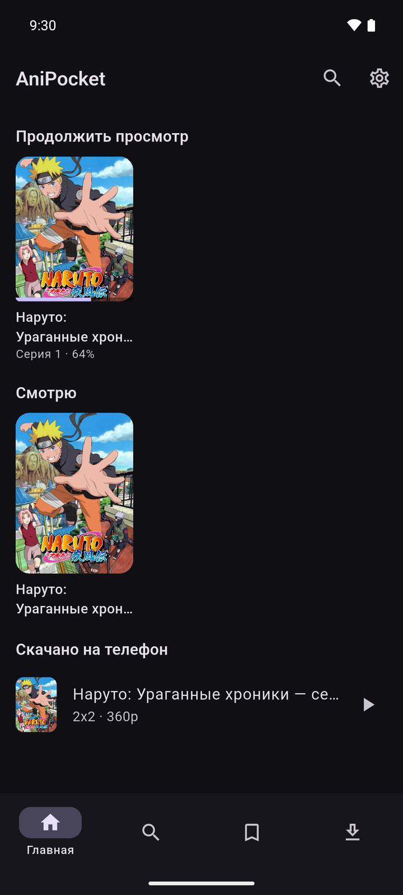
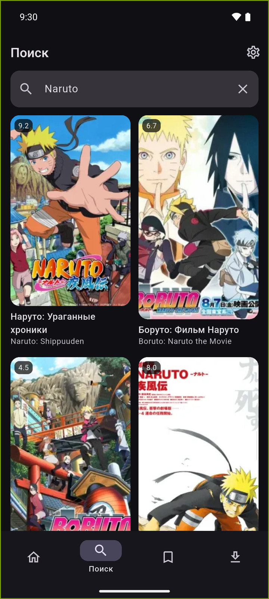
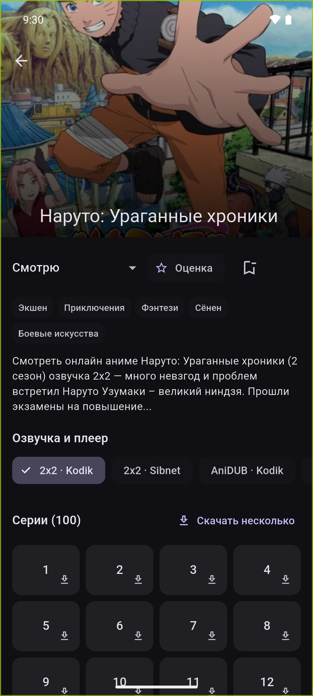
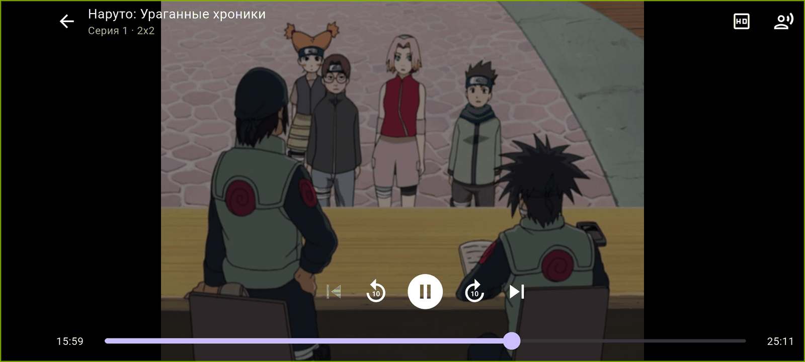
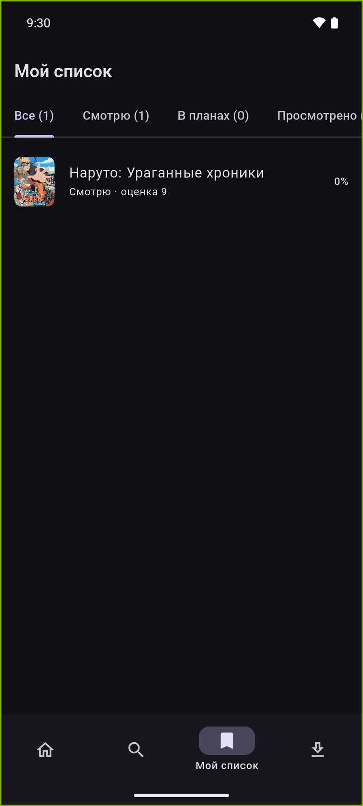
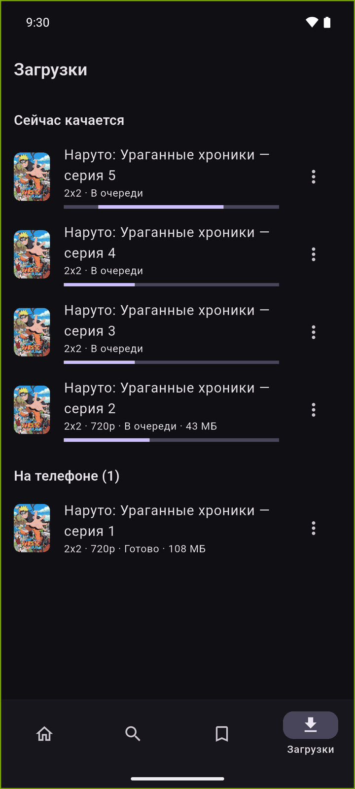

# AniPocket

**Смотреть и скачивать аниме на телефоне. Без аккаунта и без сервера.**

[](https://github.com/ialakey/anipocket/actions/workflows/ci.yml)
[](https://github.com/ialakey/anipocket/releases/latest)
[](https://github.com/ialakey/anipocket/releases)
[](https://flutter.dev)
[](LICENSE)

[English](README.md) · [Русский](README.ru.md)

Flutter-приложение: смотреть и скачивать аниме на телефоне. Без регистрации, без
сервера, без аккаунтов — список, оценки и прогресс лежат в самом телефоне.

Это перенос на мобильник двух проектов:

* [anime-dl-core](https://github.com/ialakey/anime-dl-core) — библиотека, которая
  превращает ссылку на плеер в прямые ссылки на видео. **Переписана на Dart** и
  живёт внутри приложения ([`lib/anime/`](lib/anime));
* [anime-watch-together](https://github.com/ialakey/anime-watch-together) — сайт:
  каталог, личный список, отслеживание серий. Перенесены каталог, список и
  прогресс; совместный просмотр (комнаты) не переносился — он требует сервера.

| Главная | Поиск | Страница тайтла |
|---|---|---|
|  |  |  |

| Плеер | Мой список | Загрузки |
|---|---|---|
|  |  |  |

> Все скриншоты сняты с живого приложения на эмуляторе Android 16 (API 36),
> каталог настоящий — ничего не нарисовано.

---

## Скачать

APK лежит в [последнем релизе](https://github.com/ialakey/anipocket/releases/latest) —
`arm64-v8a` подходит практически любому телефону, выпущенному за последние лет десять.

Сборки в Play Store нет: у приложения нет ни аккаунтов, ни сервера, ни того, что
можно продавать. Каждый APK подписан релизным ключом проекта и несёт
provenance-аттестацию Sigstore, привязанную к коммиту, из которого он собран, —
скачанный файл можно сверить с этим репозиторием:

```bash
gh attestation verify anipocket-1.0.0-arm64-v8a.apk -R ialakey/anipocket
```

---

## Документация

| Документ | Что внутри |
|---|---|
| [Руководство пользователя](docs/ru/user-guide.md) | Каждый экран и каждая кнопка, со скриншотами |
| [Архитектура](docs/ru/architecture.md) | Слои, поток данных, плееры, схема базы |
| [Разработка](docs/ru/development.md) | Сборка, запуск, тесты, релиз, структура проекта |
| [Что ломается и как чинить](docs/ru/troubleshooting.md) | Симптомы, причины, лечение |

Английские версии лежат в [`docs/en/`](docs/en). Список всех скриншотов —
в [`docs/screenshots/INDEX.md`](docs/screenshots/INDEX.md).

---

## Почему без сервера

Сайту нужен серверный видеопрокси, и не от хорошей жизни: CDN не отдаёт файл без
`Referer`, а браузер такой заголовок из `<video src>` не пошлёт. Плюс ссылка
привязана к IP того, кто её получил, — то есть к серверу.

В мобильном приложении обоих ограничений нет: `Referer` уходит прямо в ExoPlayer
(`VideoPlayerController.networkUrl(..., httpHeaders: ...)`), а ссылку получает и
использует один и тот же телефон. Поэтому приложение ходит к сайтам и плеерам
само, и никакой инфраструктуры для него поднимать не надо.

```
Телефон ──► AnimeGO / Animedia ──► ссылки на плееры
   │
   ├──► Aniboom / Kodik / CVH / Sibnet / Animedia / AniLibria / VK ──► прямые ссылки
   │
   ├──► ExoPlayer (заголовки едут вместе со ссылкой)
   └──► загрузчик (mp4 докачкой, HLS — склейкой сегментов)
```

---

## Что умеет

**Просмотр**
* Поиск по каталогу: AnimeGO (по умолчанию) или Animedia.
* Страница тайтла: постер, описание, жанры, список серий, выбор озвучки и плеера.
* Плеер во весь экран: перемотка ±10 секунд, выбор качества, смена озвучки на
  лету, переход к следующей серии, кнопка «пропустить опенинг» там, где плеер
  отдаёт таймкоды.
* Позиция запоминается; серия отмечается просмотренной после 85% (настраивается).

**Локальный кабинет**
* Списки со статусами: смотрю, в планах, просмотрено, отложено, брошено.
* Личные оценки 1–10, счётчик серий, «продолжить просмотр» на главной.
* Всё в sqlite на телефоне. Ни авторизации, ни синхронизации.

**Скачивание**
* Любая серия — в файл, очередь по одной серии за раз, пауза и докачка.
* Диапазон серий одной кнопкой («скачать несколько»).
* Скачанное играется из файла и не требует сети.
* Состояние очереди переживает перезапуск приложения.

---

## Как устроен код

```
lib/
├── core/                HTTP-клиент (dio), ошибки, разбор html/m3u8, шифр Kodik
├── anime/               порт anime-dl-core
│   ├── models.dart      VideoStream, PlayerResult, SkipSegment
│   ├── registry.dart    по ссылке находит нужный плеер
│   ├── players/         aniboom, kodik, cvh, sibnet, animedia, anilibria, vk
│   ├── sources/         AnimeGO и Animedia: поиск, серии, список плееров
│   └── catalog.dart     фасад с TTL-кэшем и выбором дорожки
├── data/                sqlite, список, прогресс, настройки
├── services/            загрузчик серий и очередь загрузок
└── ui/                  экраны: главная, поиск, тайтл, плеер, список, загрузки
```

Названия классов и структура повторяют python-библиотеку, так что чинить разбор
удобно по обоим репозиториям сразу: сломался плеер — правится регулярка в
соответствующем `lib/anime/players/*.dart`.

---

## Сборка

```bash
flutter pub get
flutter run                     # на подключённом устройстве
flutter build apk --release     # APK, 54 МБ (все ABI в одном файле)
flutter build apk --split-per-abi   # по APK на архитектуру, ~18 МБ каждый
```

Нужен Flutter 3.47+ (Dart 3.13) и Android SDK. Проект собирается под Android;
папка `ios/` сгенерирована, но не проверялась.

## Тесты

```bash
flutter test
```

53 теста, сеть не трогается: разбор плееров проверяется на тех же сохранённых
ответах, что и в python-библиотеке (`test/fixtures/` — настоящие ответы Aniboom,
Kodik, CVH, Sibnet, AniLibria, VK, Animedia, включая зашифрованный ответ Kodik).
Отдельно проверен загрузчик: докачка mp4, склейка HLS, инициализация fMP4 и
отказы на зашифрованных сегментах и раздельном звуке.

Живая проверка (ходит в настоящие сайты, поэтому вне `flutter test`):

```bash
dart run tool/smoke.dart "Магическая битва"
dart run tool/smoke.dart "Боруто" --source animedia
```

Скрипт проходит всю цепочку — поиск, серии, плееры, прямые ссылки — и дёргает
первые байты у CDN, чтобы было видно: заголовки приняты, файл отдаётся.

---

## Ограничения, о которых стоит знать

* **Aniboom не скачивается.** Он отдаёт fMP4, где звук лежит отдельной дорожкой,
  а собрать это в один файл без перекодирования нельзя. Приложение это понимает:
  для скачивания оно само берёт ту же серию у другого плеера (Kodik, CVH, Sibnet
  почти всегда есть рядом). Смотреть Aniboom при этом можно — ExoPlayer с
  раздельными дорожками справляется сам.
* **Зашифрованные HLS** (`#EXT-X-KEY`) не скачиваются — только смотрятся.
* **Загрузки идут, пока приложение запущено.** Фоновая служба не поднимается;
  очередь сохраняется и продолжается при следующем запуске.
* **Файлы лежат во внутренней папке приложения** — разрешения не нужны, но при
  удалении приложения удалятся и скачанные серии.
* **Прокси — только HTTP** (socks не поддержан пакетом dio на Android).
* **Сайты меняют вёрстку.** Когда поиск или плеер отвалятся, ошибка будет
  конкретной («не удалось найти …»), а чинить надо регулярку в соответствующем
  файле. Помогает также зеркало AnimeGO или переключение источника в настройках.
* Комнаты совместного просмотра, уведомления о новых сериях и профили других
  пользователей не переносились: всё это живёт на сервере.

### Одно отличие от python-библиотеки

У Kodik адрес эндпоинта (`/ftor`) лежит в скрипте страницы. Для ссылок
`/seria/...` это `app.player.*.js`, а для `/serial/...` — `app.serial.*.js`.
Библиотека берёт первый попавшийся `app.player`, поэтому на сериалах ломается;
здесь скрипты перебираются, и сработавший запоминается
([`lib/anime/players/kodik.dart`](lib/anime/players/kodik.dart), `_findPostPath`).

## Ответственность

Приложение ничего не хранит и не раздаёт: оно читает ровно то, что сторонние
плееры уже опубликовали, — так же, как это делает обычный браузер. Что с этим
делать дальше — на совести владельца телефона.
