# User guide

[English](../en/user-guide.md) · [Русский](../ru/user-guide.md)

Every screen of the app, in the order you meet them. All screenshots come from a
real run on an Android 16 (API 36) emulator against the live catalog.

The app has four tabs at the bottom — **Home**, **Search**, **My list**,
**Downloads** — and a Settings screen reachable from the gear icon.

---

## 1. Home

On a fresh install the home screen is empty on purpose: there is nothing to sign
in to and nothing to configure before you start.

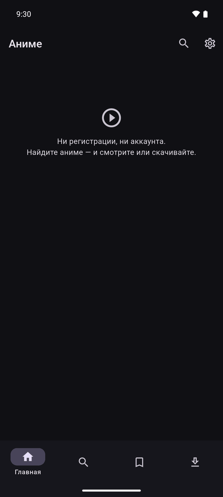

Once you start watching, the same screen fills up with three sections:

* **Continue watching** — every episode you left unfinished, with the episode
  number and the percentage you reached. Tapping a card opens the player right at
  that position.
* **Watching** — titles you marked as *watching*. Tapping opens the title page.
* **Downloaded to the phone** — the five most recent finished downloads; tapping
  plays them from the file, offline.

The two icons in the top right are search and settings.

---

## 2. Search

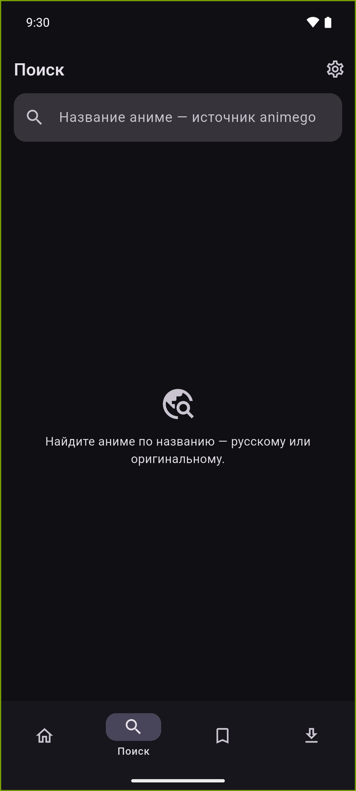

Type at least two characters and press enter. The hint under the magnifier tells
you which source you are searching — `animego` or `animedia` — so you always know
where the results came from. You can search by the Russian title or the original
one.

Results come back as a poster grid: the rating reported by the site sits in the
top-left badge, the Russian title underneath, and the original title below that.
Tap a card to open the title page.

If the source refuses to answer (usually its bot protection), the screen shows the
reason and a retry button instead of the grid. See
[Troubleshooting](troubleshooting.md).

---

## 3. Title page

Everything about one title lives here:

| Element | What it does |
|---|---|
| Poster header | Collapses into an app bar as you scroll |
| **Add to list** | Dropdown with the five statuses |
| **Rating** chip | Your personal score, 1–10 |
| Bookmark icon | Removes the title from your list |
| Genre chips | As reported by the source |
| Description | Tap to expand or collapse |
| **Dub and player** | One chip per dub/player combination |
| **Episodes (N)** | Grid of episode tiles |
| **Download several** | Range dialog for bulk downloading |

### Status and rating

Tap **Add to list** and pick a status. The list is local — nothing leaves the
phone.

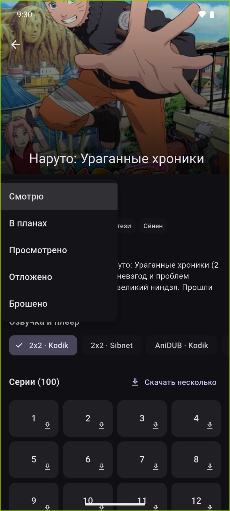

Once the title is in the list, a rating chip appears next to it. Ratings go from
1 to 10, and "Remove rating" clears it.

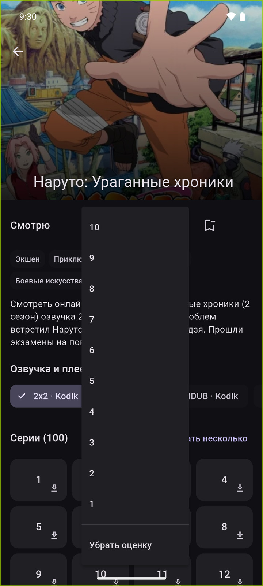

### Dub and player

Each chip is one dub on one player, for example `2x2 · Kodik`, `2x2 · Sibnet`,
`AniDUB · Kodik`. The choice affects both playback and downloading: the episode
tiles below and the download buttons all follow the selected chip.

The app remembers the dub you used last time for this title and pre-selects it.

### Episode tiles

* **Tap** — play the episode.
* **Long-press** or the small arrow — queue it for download.
* A check mark in the corner means the episode is watched; a percentage means you
  stopped part-way through.
* A download icon in the top-left corner means the episode is queued or already
  on the phone.

---

## 4. Player

The player goes full screen and locks to landscape. Tap anywhere to show or hide
the controls; they hide themselves after three seconds.

| Control | What it does |
|---|---|
| Back arrow | Leave the player (progress is saved) |
| Title / subtitle | Title, episode number and dub — or "downloaded" when playing a file |
| **HD** icon | Quality picker |
| Voice icon | Dub picker |
| Previous / next | Jump an episode back or forward |
| Replay 10 / Forward 10 | Seek ten seconds back or forward |
| Play / pause | Exactly that |
| Seek bar | Position and duration |

The screen stays awake while you watch (`wakelock_plus`), and your position is
written to the database every 15 seconds and again when you leave.

### Quality

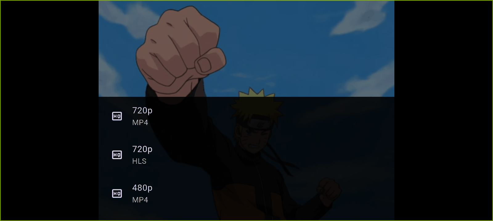

The sheet lists every track the player handed over, with its container underneath
— `MP4`, `HLS` or `DASH`. An adaptive HLS master playlist shows up as "Auto
(adaptive)" and lets ExoPlayer pick the bitrate itself. Switching quality keeps
your current position.

The **Maximum quality** setting caps what is requested in the first place.

### Dub

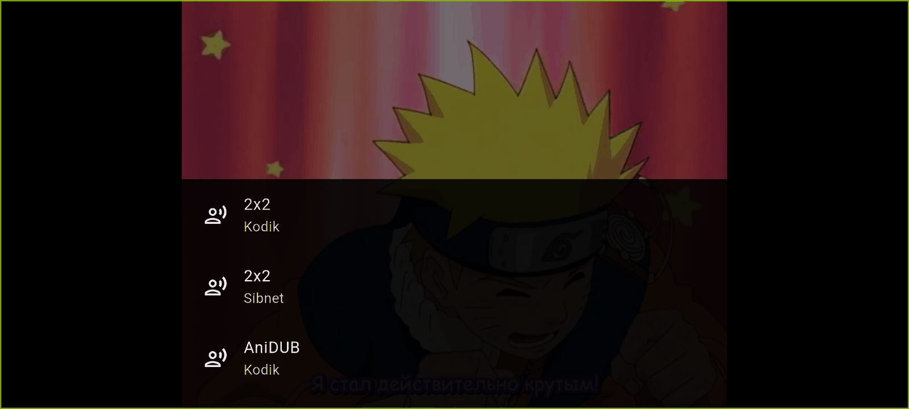

Switching the dub here re-resolves the episode through the other player and
resumes from the same position — useful when one player stalls or goes missing.

### Skip the opening

Where a player exposes timecodes (AniLibria does, for example), a **Skip the
opening** button appears over the video for the duration of the segment. Pressing
it seeks to the end of the segment.

---

## 5. My list

Your local library: five status tabs plus "All", each with a counter.

Each row shows the poster, the title, the status, the last watched episode (and
the total, when the source reports it) and your rating. On the right is the
percentage of the title you have finished.

* **Tap** — open the title page, positioned at the episode you stopped on.
* **Long-press** — the action sheet below.

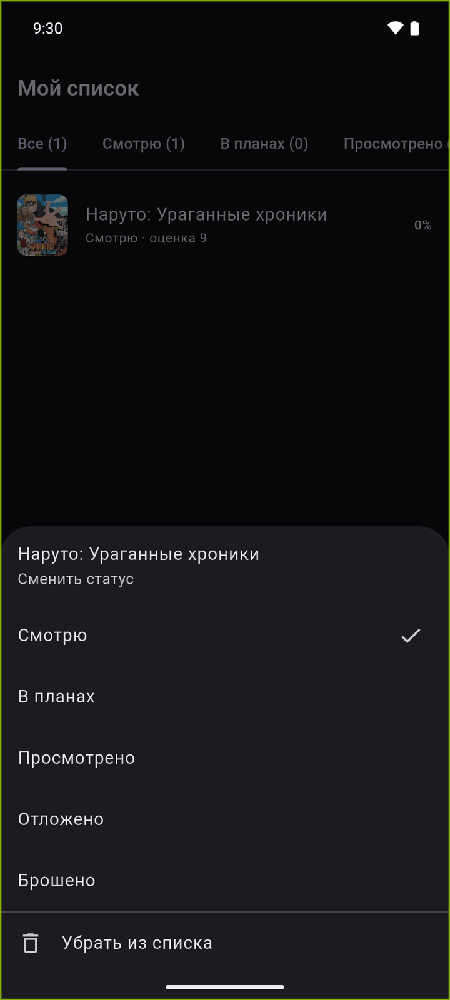

From there you can move the title to another status or remove it from the list.
Removing a title also deletes its per-episode progress.

---

## 6. Downloads

### Queueing a single episode

Long-press an episode tile (or use its download arrow) on the title page. The
episode joins the queue with the dub currently selected.

### Queueing a range

**Download several** on the title page opens the range dialog. Two sliders pick
the first and the last episode; the count updates as you drag.

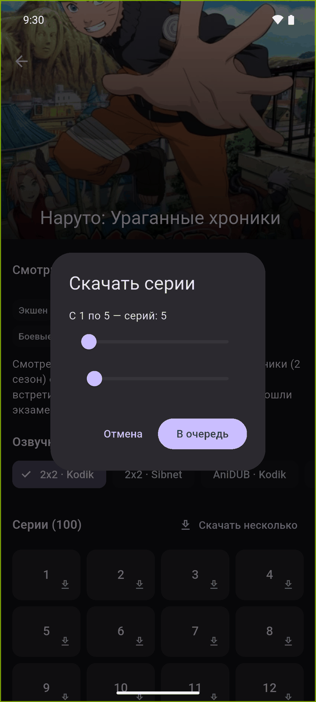

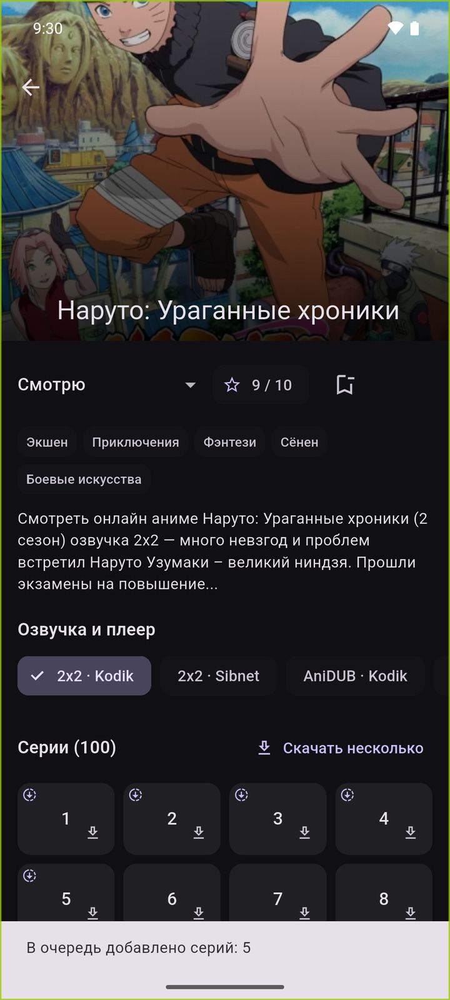

A snackbar confirms how many episodes were added, and the queued tiles get a
download marker.

### The downloads screen

Three sections, shown only when they have something in them:

* **Downloading now** — the queue; one episode is fetched at a time.
* **Stopped** — paused and failed tasks. A failed task shows the reason.
* **On the phone (N)** — finished files. Tap one to play it offline.

Each row shows the dub, the quality, the status and either the number of bytes
received or the segment count for HLS.

The overflow menu on each row offers what makes sense for that task:

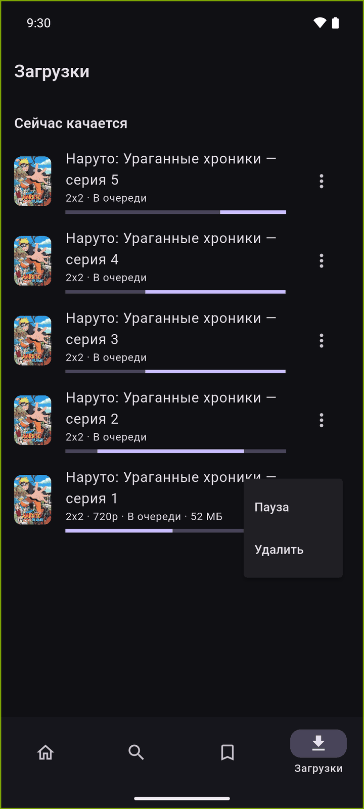

| Action | Available when |
|---|---|
| **Watch** | The file is finished |
| **Pause** | The task is queued or running |
| **Resume** | The task is paused or failed |
| **Delete** | Always — removes the task and the file |

Downloads only run while the app is open. If you close it mid-download, running
tasks become *paused* and pick up where they left off on the next launch — mp4
resumes by byte range, HLS from the next segment.

### Watching offline

A finished episode plays from the file and needs no network at all. The player
subtitle says "downloaded" instead of naming a player, and the quality picker is
gone — there is only one track, the file. Your saved position still applies.

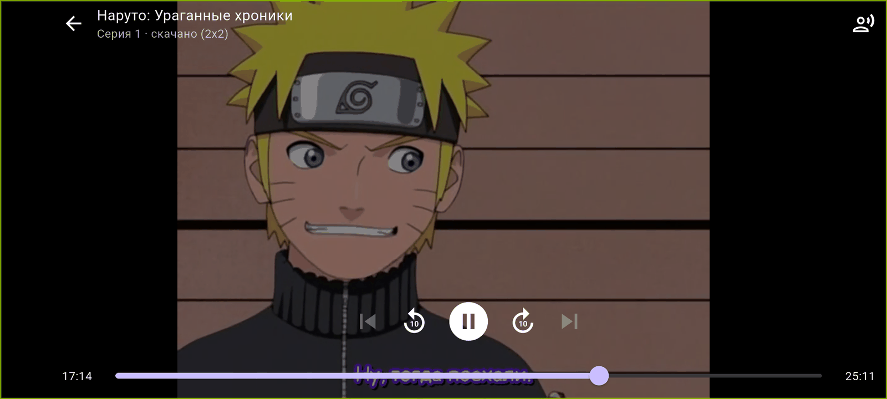

> The screenshot above was taken with Wi-Fi and mobile data switched off.

---

## 7. Settings

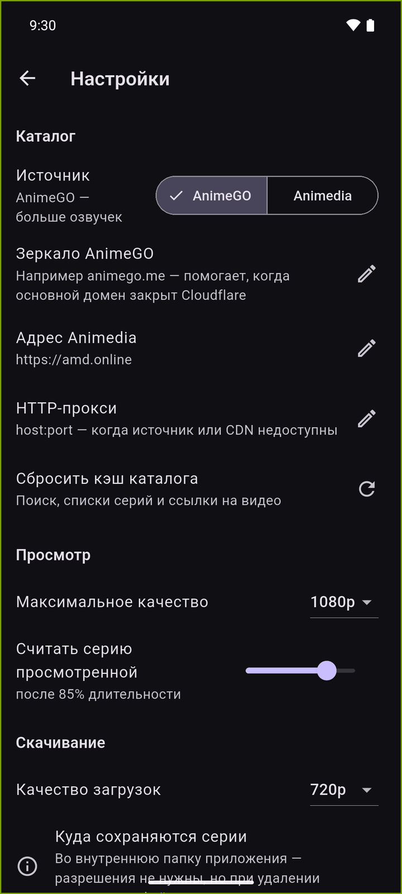

**Catalog**

| Setting | Meaning |
|---|---|
| **Source** | AnimeGO (more dubs) or Animedia |
| **AnimeGO mirror** | For example `animego.me`, when the main domain is behind Cloudflare |
| **Animedia address** | The domain moves from time to time; default `https://amd.online` |
| **HTTP proxy** | `host:port`, when the source or the CDN is unreachable |
| **Clear the catalog cache** | Drops cached search results, episode lists and video links |

Changing the source, the mirror, the address or the proxy rebuilds the HTTP client
and clears the caches automatically.

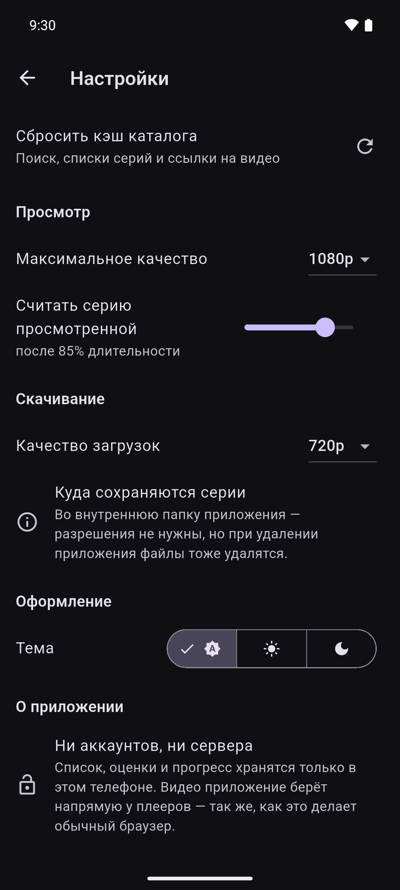

**Watching**

| Setting | Meaning |
|---|---|
| **Maximum quality** | 360p … 2160p; tracks above it are not requested. Default 1080p |
| **Count an episode as watched** | After this share of the duration. Default 85 % |

**Downloading**

| Setting | Meaning |
|---|---|
| **Download quality** | Default 720p |
| Where episodes are saved | Informational: the internal app folder, no permissions needed — uninstalling the app deletes them |

**Appearance** — theme: system, light or dark. The app is designed dark-first.

**About** — a reminder that there are no accounts and no server: the list, the
ratings and the progress stay on this phone, and video is taken straight from the
players, exactly the way a browser does it.
